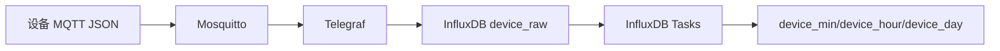
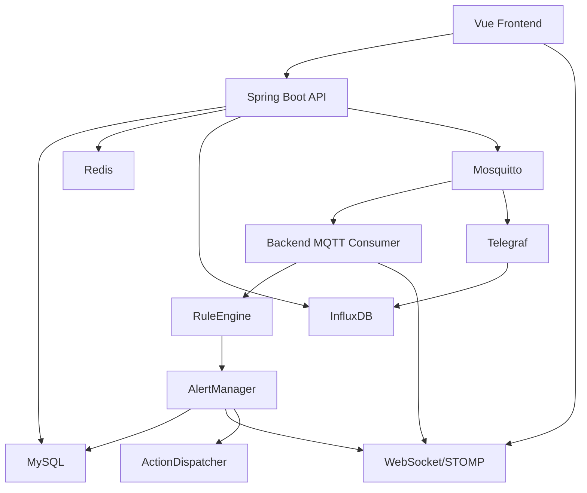
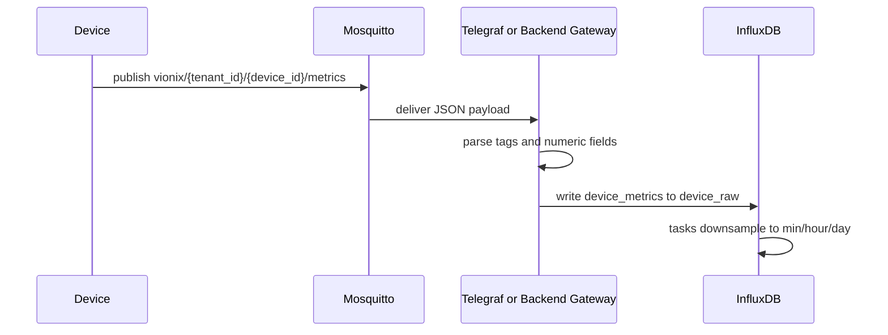
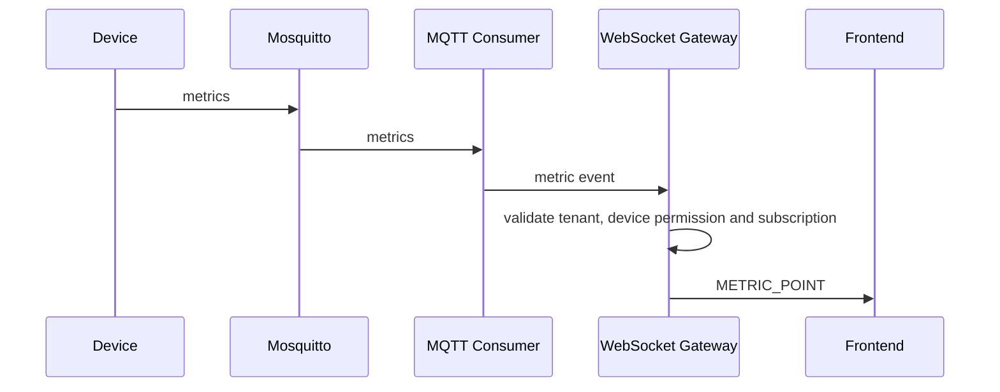
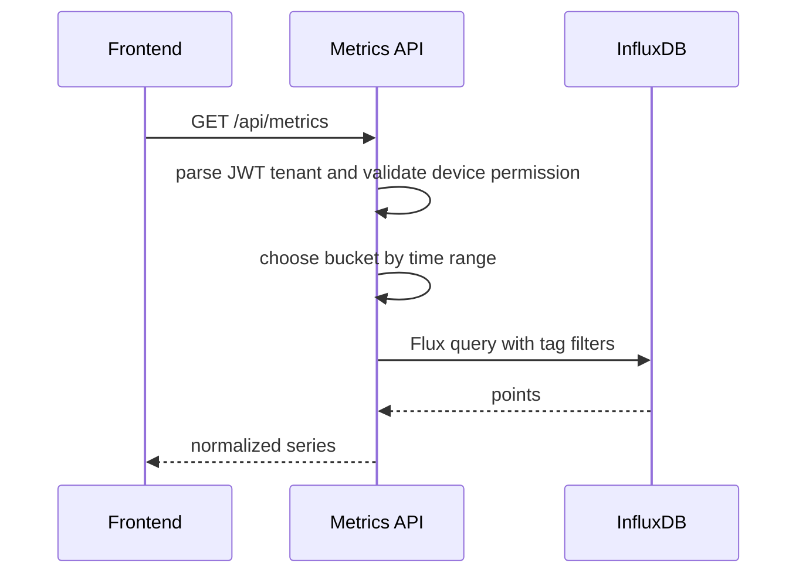
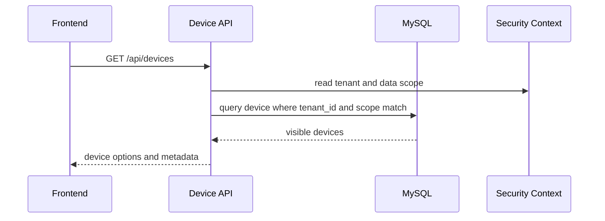
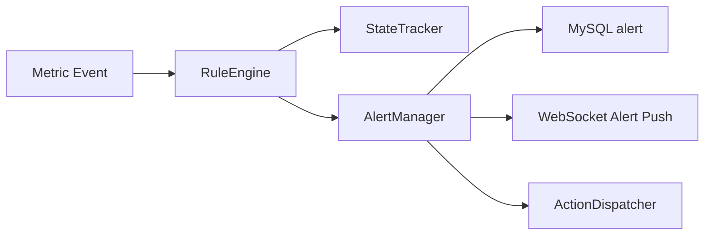

# Vionix 总体设计说明书

## 1. 架构目标

Vionix 采用前后端分离架构，后端统一承载认证授权、时序查询、实时推送、规则计算、仪表盘元数据和租户隔离能力；InfluxDB 存储时序数据，MySQL 存储业务元数据，Redis 存储共享安全状态。

## 2. 阶段架构

### 2.1 当前最小架构



当前最小架构只验证基础设施和时序链路，不提供用户登录、API、WebSocket、规则引擎和前端页面。

### 2.2 目标完整架构



## 3. 模块划分

| 模块 | 所属 | 职责 |
|------|------|------|
| Auth/RBAC | Backend | 登录、刷新、登出、权限校验、租户上下文、数据范围 |
| Tenant Management | Backend | 租户生命周期、租户配置、超级管理员操作 |
| Device Directory | Backend | 租户内设备目录、设备状态、设备数据权限和分组选项 |
| Metrics API | Backend | InfluxDB 查询路由、tag 过滤、字段映射、返回统一格式 |
| MQTT Consumer | Backend | 订阅设备消息，解析 `tenant_id + device_id + metrics` |
| WebSocket Gateway | Backend | STOMP 鉴权、订阅校验、实时指标和告警推送 |
| RuleEngine | Backend | 规则加载、编译缓存、条件评估、滑动窗口 |
| AlertManager | Backend | 告警状态、抑制、恢复、升级、查询 |
| ActionDispatcher | Backend | 执行动作并记录日志 |
| Dashboard API | Backend | 仪表盘元数据、变量选项、权限控制 |
| Web Monitoring | Frontend | 实时监控、历史趋势、告警角标 |
| Dashboard Editor | Frontend | 低代码布局编辑、组件配置、变量绑定 |
| InfluxDB Tasks | Infra | 秒到分钟、分钟到小时、小时到天降采样 |

## 4. 核心数据流

### 4.1 指标写入流



写入端只写原始秒级数据。聚合数据由 InfluxDB Task 生成。

### 4.2 实时推送流



安全边界在服务端，前端过滤只能作为展示优化。

### 4.3 历史查询流



### 4.4 设备目录和权限流



设备目录是历史查询、实时订阅、规则目标、设备分组和仪表盘变量的共同权限来源。生产环境中未登记或已禁用设备不得作为规则目标，也不得通过 WebSocket 订阅授权。

### 4.5 规则告警流



## 5. 技术选型

| 层 | 技术 | 说明 |
|----|------|------|
| 后端 | Java 17 + Spring Boot | 主业务服务 |
| ORM | MyBatis-Plus | 多租户拦截、CRUD、分页 |
| 关系数据库 | MySQL 8 | 用户、权限、规则、告警、仪表盘 |
| 时序数据库 | InfluxDB 2.x | 秒级原始数据和聚合数据 |
| 缓存 | Redis 7 | token 黑名单、登录失败计数、权限缓存 |
| 消息接入 | Mosquitto + MQTT Client | 设备数据接入 |
| 采集网关 | Telegraf | 当前基础设施数据写入 |
| 前端 | Vue 3 + ECharts | 管理端和监控大屏 |
| 实时协议 | WebSocket/STOMP | 鉴权订阅和按 topic 推送 |
| 容器化 | Docker Compose | 本地、测试和单机部署基线 |

## 6. 租户和权限架构

后端请求处理链路：

```
HTTP/WS Request
  -> JWT 解析
  -> SecurityContext(userId, tenantId, roles, permissions, dataScope)
  -> API 权限校验
  -> 数据权限校验，包含设备目录和设备分组范围
  -> MyBatis tenant_id 自动过滤或 InfluxDB tag 过滤
  -> Controller/Service
```

普通租户用户的租户来自 token。只有超级管理员可以通过受控入口指定目标租户。

## 7. 部署架构

| 环境 | 组件 | 说明 |
|------|------|------|
| 当前本地基础设施 | Mosquitto、Telegraf、InfluxDB | 已由仓库 Compose 支持 |
| 完整开发环境 | 当前组件 + MySQL、Redis、Backend、Frontend | 待应用目录和初始化脚本补齐 |
| 测试环境 | 完整环境，使用独立数据卷和测试密钥 | 用于接口、集成、端到端测试 |
| 生产环境 | 完整环境，外置 Secret、持久化、备份、监控 | Redis 必需，HTTPS/WSS 必需 |

## 8. 关键架构约束

1. `tenant_id + device_id` 是全链路设备数据主键。
2. 生产环境的 `device_id` 必须存在于当前租户设备目录且处于启用状态。
3. InfluxDB 聚合层字段名不随层级叠加后缀。
4. 规则、告警、分组、仪表盘等业务表必须直接携带 `tenant_id`。
5. WebSocket topic 订阅必须逐次校验租户和数据权限。
6. Redis 不可在生产和多实例环境中省略。
7. Backend 和 Frontend 未补齐前，`docker compose up -d` 不应宣称启动完整平台。
