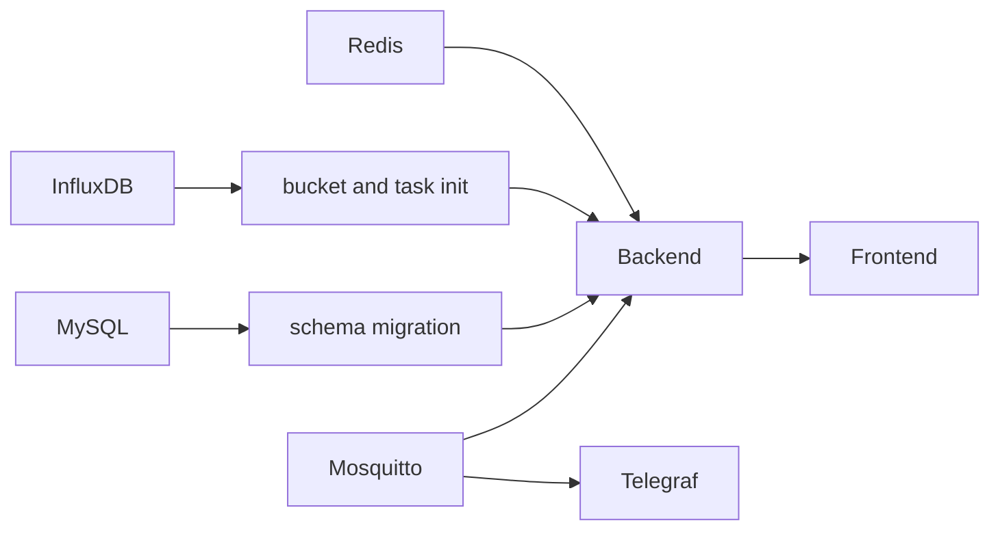

# Vionix 部署运维说明书

## 1. 部署阶段

| 阶段 | 组件 | 状态 |
|------|------|------|
| 当前最小基础设施 | Mosquitto、Telegraf、InfluxDB | 当前仓库默认 Compose 可启动 |
| 目标完整环境 | 当前组件 + MySQL、Redis、Backend、Frontend | Backend 骨架和迁移入口已开始交付，Frontend 与完整编排待补齐 |
| 生产环境 | 完整环境 + HTTPS/WSS + Secret + 备份 + 监控 | 发布前建设 |

## 2. 当前最小环境

启动：

```bash
docker compose up -d
```

验证：

```bash
docker compose ps
docker compose logs -f telegraf
```

可访问：

| 服务 | 地址 |
|------|------|
| MQTT Broker | `localhost:1883` |
| InfluxDB UI | `http://localhost:8086` |

当前不可访问：

| 能力 | 原因 |
|------|------|
| Backend API | 已有 M1 骨架，但未纳入当前 Compose，业务 API 尚未交付 |
| Frontend 页面 | 尚未交付 `frontend/` |
| WebSocket | 尚未交付后端 WS 服务 |
| MySQL/Redis | 已通过 `m1` profile 提供给后端骨架验证，默认 Compose 不启动 |

## 3. 目标完整环境组件

| 服务 | 端口 | 职责 |
|------|------|------|
| Mosquitto | 1883 | MQTT Broker |
| Telegraf | 无 | MQTT JSON 到 InfluxDB |
| InfluxDB | 8086 | 时序数据 |
| MySQL | 3306 | 业务元数据 |
| Redis | 6379 | 安全状态和缓存 |
| Backend | 8080 | API、WS、规则引擎 |
| Frontend | 80/443 | Vue 静态资源和反向代理 |

## 4. 环境变量

| 变量 | 必填 | 说明 |
|------|------|------|
| `MYSQL_ROOT_PASSWORD` | 是 | MySQL root 密码 |
| `MYSQL_PASSWORD` | 是 | 应用数据库密码 |
| `AUTH_JWT_SECRET` | 是 | JWT 签名密钥 |
| `AUTH_TOKEN_HASH_SALT` | 是 | refreshToken hash 部署级盐 |
| `INFLUXDB_TOKEN` | 是 | InfluxDB token |
| `INFLUXDB_ORG` | 是 | InfluxDB org，默认 `vionix` |
| `INFLUXDB_BUCKET` | 是 | 默认 raw bucket |
| `SPRING_DATA_REDIS_HOST` | 是 | Redis host |
| `MQTT_BROKER` | 是 | MQTT broker 地址 |

敏感变量必须来自环境变量、Docker Secret、KMS 或平台 Secret，不得写死在普通 `application.yml`、Compose 或镜像中。

## 5. 初始化顺序



## 6. 健康检查

| 服务 | 检查方式 |
|------|----------|
| Backend | `GET /actuator/health` |
| Frontend | Nginx 静态资源和反向代理状态 |
| InfluxDB | `/health` |
| MySQL | `mysqladmin ping` |
| Redis | `redis-cli ping` |
| Mosquitto | 端口连通和测试 topic |
| Telegraf | 容器日志和 InfluxDB 写入验证 |

## 7. 日志要求

Backend 日志字段：

| 字段 | 说明 |
|------|------|
| `traceId` | 请求链路标识 |
| `tenantId` | 当前租户 |
| `userId` | 当前用户 |
| `method/path` | 请求信息 |
| `durationMs` | 耗时 |
| `status` | 响应状态 |

不得记录密码、token、JWT、私钥、数据库密码和动作配置中的敏感 token。

## 8. 备份与恢复

| 数据 | 备份策略 |
|------|----------|
| MySQL | 定期全量 + binlog 或增量备份 |
| InfluxDB | bucket 备份，重点保护 `device_hour` 和 `device_day` |
| Redis | 可选持久化，安全状态可接受短期丢失时需评估影响 |
| 配置和 Secret | 使用平台 Secret 版本管理，不放入仓库 |

恢复演练需至少覆盖 MySQL schema、核心业务数据、InfluxDB 历史 bucket 和应用配置。

## 9. 可观测性

| 类型 | 要求 |
|------|------|
| 日志 | Backend 输出结构化日志，包含 traceId、tenantId、userId、接口、耗时和结果 |
| 指标 | 暴露 API 延迟、错误率、MQTT 消费量、规则评估耗时、WS 连接数、推送失败数 |
| 健康 | 区分存活检查和就绪检查，依赖 MySQL、Redis、InfluxDB、Mosquitto 的状态 |
| 告警 | 生产环境至少覆盖服务不可用、错误率升高、消息积压、磁盘空间和数据库连接异常 |
| 追踪 | 外部入口生成 traceId，异步规则和动作日志传递同一 traceId |

## 10. CI/CD 基线

主干合并前至少执行：

1. 后端编译和单元测试。
2. 前端安装、类型/语法检查、构建。
3. Markdown 链接和格式检查。
4. 数据库迁移脚本校验。
5. 密钥扫描，阻止 token、密码、私钥进入仓库。
6. 与本次变更相关的集成测试。

发布流水线至少记录镜像 tag、提交 SHA、迁移版本、配置版本和发布人。生产发布失败时必须能回滚到上一镜像版本；数据库迁移若不可逆，必须提供补偿脚本或明确停机窗口。

## 11. 发布流程

1. 合并前通过单元、集成、安全关键测试。
2. 构建 Backend 和 Frontend 镜像。
3. 测试环境执行数据库迁移和冒烟测试。
4. 生产执行备份。
5. 滚动或短暂停机发布。
6. 发布后检查健康、日志、告警、关键接口和 WebSocket。
7. 如失败，按镜像版本和数据库迁移策略回滚。

## 12. 生产要求

1. 使用 HTTPS/WSS。
2. Redis 必须启用。
3. 数据卷必须持久化并纳入备份。
4. 不使用默认密码和弱密钥。
5. InfluxDB token 最小权限化。
6. 管理端限制跨域来源。
7. 告警动作外发 URL 需要白名单或审批。
