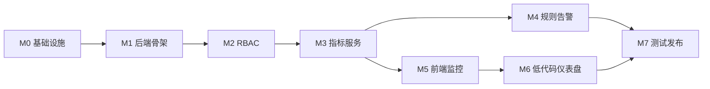

# Vionix 实施计划与质量管理

## 1. 实施原则

1. 先打通基础链路，再建设业务能力。
2. 先实现租户、权限和数据边界，再开放多用户功能。
3. 所有可见功能必须具备接口、数据、测试和部署文档。
4. 任何功能上线前必须验证跨租户隔离。

## 2. 里程碑

| 阶段 | 目标 | 主要交付物 |
|------|------|------------|
| M0 基础设施校准 | 修正基础设施和 InfluxDB 降采样 | Compose、InfluxDB Task、验证脚本 |
| M1 后端骨架 | 建立 Spring Boot 4、MySQL、Redis、基础配置 | Backend 工程、健康检查、迁移脚本 |
| M2 RBAC | 完成租户、用户、角色、权限、认证 | Auth/RBAC API、权限拦截、测试 |
| M3 指标服务 | 完成设备目录、MQTT 消费、Metrics API、WS 指标推送 | Device API、MQTT Consumer、Influx 查询、WS Gateway |
| M4 规则告警 | 完成规则、分组、告警和动作日志 | RuleEngine、AlertManager、ActionDispatcher |
| M5 前端监控 | 完成登录、实时监控、历史趋势、告警中心 | Vue 前端、图表、WS 订阅 |
| M6 低代码仪表盘 | 完成仪表盘 CRUD、编辑器、变量和组件 | Dashboard API、Editor、组件库 |
| M7 测试发布 | 完成端到端测试、部署文档和生产基线 | 测试报告、发布包、运维手册 |

## 3. 依赖顺序

## 4. 工作分解

### M0 基础设施校准

| 任务 | 输出 |
|------|------|
| 修正 Telegraf topic/tag 提取方案 | `tenant_id`、`device_id`、`source` 进入 InfluxDB tag |
| 修正 InfluxDB Task | 聚合字段无二次后缀，均值按 count 加权 |
| 增加本地验证说明 | MQTT 发布和 InfluxDB 查询示例 |

### M1 后端骨架

| 任务 | 输出 |
|------|------|
| 创建 Spring Boot 4 工程 | `backend/` |
| 接入 MySQL、Redis、InfluxDB、MQTT | 配置类和健康检查 |
| 建立通用响应和错误码 | `Result`、`PageResult`、`ErrorCode` |
| 建立数据库迁移机制 | 初始化 schema |

### M2 RBAC

| 任务 | 输出 |
|------|------|
| 实现登录、刷新、登出 | Auth API |
| 实现用户、角色、权限 | RBAC API |
| 实现租户上下文 | MyBatis tenant interceptor |
| 实现权限注解和 AOP | API 权限控制 |
| 实现 Redis 安全状态 | token 黑名单、失败计数、权限缓存 |

### M3 指标服务

| 任务 | 输出 |
|------|------|
| 实现 MQTT Consumer | 实时指标事件 |
| 实现设备目录 | 设备 CRUD、启停、可见设备列表 |
| 实现 InfluxDB 查询服务 | `/api/metrics` |
| 实现 WebSocket/STOMP | 鉴权、订阅、推送 |
| 实现设备权限校验接口 | 指标查询和订阅复用 |

### M4 规则告警

| 任务 | 输出 |
|------|------|
| 实现设备分组 | CRUD 和设备绑定 |
| 实现规则 CRUD | 条件、动作、启停 |
| 实现 RuleEngine | 编译缓存、索引、窗口状态 |
| 实现告警管理 | 触发、恢复、抑制、统计 |
| 实现动作分发 | MQTT/HTTP/IM 扩展点和日志 |

### M5 前端监控

| 任务 | 输出 |
|------|------|
| 实现登录和权限路由 | 登录页、菜单、按钮权限 |
| 实现实时监控 | WS 订阅、ECharts 曲线 |
| 实现历史趋势 | `/api/metrics` 查询 |
| 实现告警中心 | 列表、统计、实时角标 |
| 实现规则管理页面 | 规则编辑器 |

### M6 低代码仪表盘

| 任务 | 输出 |
|------|------|
| 仪表盘 CRUD | 列表、详情、发布 |
| 编辑器三栏布局 | 组件库、画布、配置面板 |
| 变量系统 | device、timeRange、metric |
| 组件数据绑定 | 复用指标 API 和 WS |
| JSON schema 校验 | 防止非法配置 |

## 5. Definition of Done

每个功能完成必须满足：

1. 需求编号明确。
2. API 文档和数据模型已更新。
3. 单元或集成测试覆盖核心逻辑。
4. 多租户和权限边界已测试。
5. 日志不泄露敏感信息。
6. 前端具备加载、空数据、错误和无权限状态。
7. 部署配置不包含明文密钥。
8. 文档和实现一致。

## 6. 风险管理

| 风险 | 影响 | 控制措施 |
|------|------|----------|
| InfluxDB 降采样实现错误 | 历史统计失真 | 专门测试不均匀采样和字段后缀 |
| 跨租户越权 | 严重安全事故 | 所有 API、WS、Influx 查询加入租户测试 |
| Redis 缺失 | 登出和登录失败策略不一致 | 生产强制 Redis，启动时检查 |
| WebSocket 广播全量 | 数据泄露 | 服务端订阅校验和 topic 精准推送 |
| 密钥写入配置 | 凭据泄露 | secret 扫描和部署检查 |
| 规则表达语义不一致 | 告警误报漏报 | 前后端共享条件语义和测试用例 |

## 7. 交付物清单

| 类别 | 交付物 |
|------|--------|
| 代码 | `backend/`、`frontend/`、`mysql/`、部署配置 |
| 数据库 | MySQL 迁移脚本、InfluxDB Task 脚本 |
| 接口 | OpenAPI 或等价接口文档、WebSocket 协议文档 |
| 测试 | 单元、集成、E2E、安全和性能测试报告 |
| 运维 | 部署说明、环境变量清单、备份恢复方案 |
| 流水线 | CI/CD 配置、密钥扫描、镜像构建和发布记录 |
| 用户 | 管理端使用说明和常见问题 |
